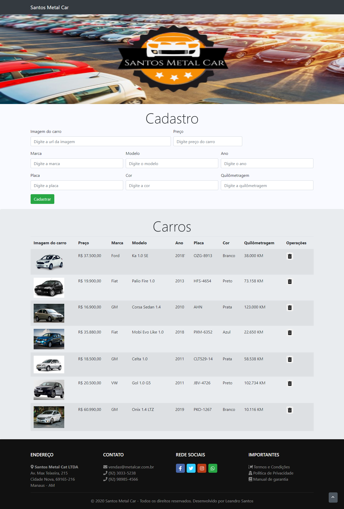

<h1 align="center">
    
</h1>

## Projeto

Santos Metal Car é um projeto que visa conectar clientes que buscam disponibilizar seus veículos para venda em plataforma online, cadastrando informações de seu automóvel e conectando clientes que procuram obter informações de veiculos como imagem e preço com maior facilidade e acessibilidade, facilitando compra e venda.

O projeto visa construir uma aplicação web na prática, utilizando Javascript como pricipal ferramenta e Bootstrap focando na responsividade.

O projeto foi desenvolvido no final do Curso [Javascript Ninja](https://blog.da2k.com.br/curso-javascript-ninja/), colocam em prática todo o conhecimento adquirido no curso e um pouco a mais. Repositório do Curso [Javascript Ninja](https://github.com/LeandroSantosGit/curso-javascript-ninja).

## Web
Na aplicação o cliente poderá inserir o veículo preenchendo os campos na área de `Cadastro`. Os veículos cadastrados são listados logo abaixo na área de `Carros`, podendo ser excluído.

## Tecnologias

Esse projeto foi desenvolvido com as seguintes tecnologias:

- [npm](https://www.npmjs.com/)
- [Node.js](https://nodejs.org/en/)
- [Express](https://expressjs.com/pt-br/)
- [Bootstrap](https://getbootstrap.com/docs/4.3/getting-started/introduction/)
- [Font Awesome](https://fontawesome.com)
- [VS Code](https://code.visualstudio.com/)

## Licença

Esse projeto está sob a licença MIT. Veja o arquivo [LICENSE](LICENSE.md) para mais detalhes.